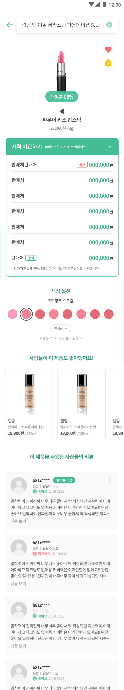

# Blended Backend Mission

## Mission

위 상품 상세 페이지를 위한  API 를 설계 및 작성하시면 됩니다.

### 유의 사항

- 매칭률, 제품 우측의 하트와 알림은 고려하지 않으셔도 됩니다.
- Data는 가상의 API Call로 남겨두셔도 좋습니다.
- 모든 요구사항을 완료하는 것보다 과정을 중요하게 생각합니다.
- Table Schema에 유의하시면서 작성하시면 됩니다.
- "제품 정보", "가격 비교", "관련 상품", "색상", "리뷰"는 별도의 API로 분리하셔도 좋습니다.
- 색상정보는 RGB (ex. #8fac9c) 로 저장됩니다.

## 우리는 이러한 점을 중심으로 평가합니다.

- Mission 을 받을 때 부터 완성될 때까지 어떻게 접근하는지를 평가합니다.
  - Git log 를 자세히 작성해 주세요
- Typescript or Javascript 활용 능력을 확인합니다.

## Tech Stack

아래 사항이 필수가 아닙니다. 필요하다면 추가로 다양한 Librery 나 도구를 사용하셔도 됩니다.

- 필수 Tech Stack
    - Javascript ( At least JS ES 6 )
        - Node.js
    - Git
    - GraphQL or RESTFUL 
    - DynamoDB or RDB
    
- 권장 Tech Stack
    - Typescript
    - Serverless

## 제출 방법
- Github 나 Gitlab 에 private repository 를 만들어주세요.
- 모든 코드의 변경 과정을 잘 정리해서 commit 해주세요.
  - commit message 도 잘 적어주세요.
- 실행 방법 및 프로젝트 소개를 README.md 파일에 정리해 주세요.
- 제한 시간 안에 마무리하신 후 해당 repository 에 recruit@cosmochain.io 계정을 collaborator(github), members(gitlab, reporter 이상의 권한 필요)로 추가해주신 후, Contact 중인 담당자 이메일로 repository 의 https 주소를 공유해주세요.
